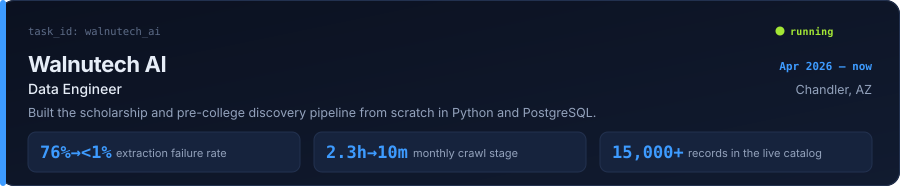
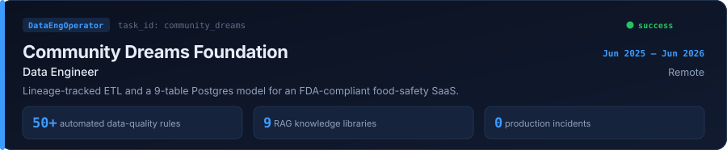
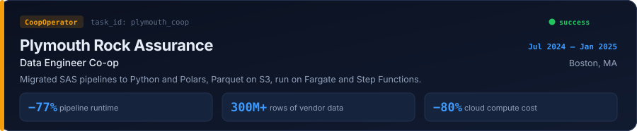
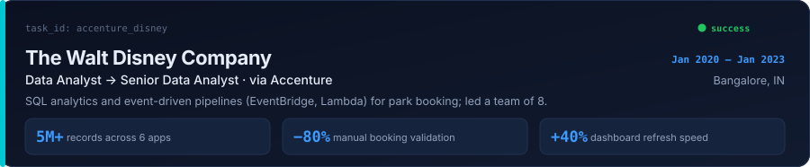
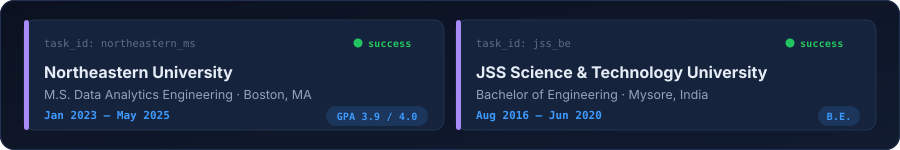

<picture>
  <source media="(prefers-color-scheme: dark)" srcset="assets/header-dark.svg">
  <source media="(prefers-color-scheme: light)" srcset="assets/header-light.svg">
  
</picture>

I build pipelines that stay correct after the demo.

Five years of it, across Disney's booking systems, a home insurer's vendor feeds and, now, a live scholarship catalog that students actually click through. The work I care about is the part nobody screenshots: the validation rule that fires before a bad batch lands, the load that can be re-run without double-counting, the lineage you can follow back when someone asks *where did this number come from*.

---

### Experience

<picture>
  <source media="(prefers-color-scheme: dark)" srcset="assets/exp-walnutech-dark.svg">
  <source media="(prefers-color-scheme: light)" srcset="assets/exp-walnutech-light.svg">
  
</picture>

Also the team's AI-native dev tooling: Claude Code agent skills for a self-revision review loop and a 0–100 production-readiness audit, wired into the PR flow.

<picture>
  <source media="(prefers-color-scheme: dark)" srcset="assets/exp-cdf-dark.svg">
  <source media="(prefers-color-scheme: light)" srcset="assets/exp-cdf-light.svg">
  
</picture>

<picture>
  <source media="(prefers-color-scheme: dark)" srcset="assets/exp-plymouth-dark.svg">
  <source media="(prefers-color-scheme: light)" srcset="assets/exp-plymouth-light.svg">
  
</picture>

> *"Manvith played a pivotal role in modernizing data pipelines during his time at Plymouth."* — Jamie Warner, who managed me there

<picture>
  <source media="(prefers-color-scheme: dark)" srcset="assets/exp-disney-dark.svg">
  <source media="(prefers-color-scheme: light)" srcset="assets/exp-disney-light.svg">
  
</picture>

---

### Built

| | |
| --- | --- |
| **[Realtime-Data-Streaming](https://github.com/manvith1604/Realtime-Data-Streaming-using-Airflow-Spark)** | Airflow → Kafka → Spark → Cassandra, end to end and fully containerised with Docker. |
| **[Olist E-commerce DB](https://github.com/manvith1604/Exploratory-Data-Analysis-on-Olist-E-commerce-Dataset)** | Relational model for a Brazilian marketplace (orders, sellers, payments, geolocation), then SQL analysis on top. |
| **[NYC Taxi Fare Estimation](https://github.com/manvith1604/NYC-Taxi-Fare-Estimation-using-Regression)** | Regression on TLC trip data to price a ride from distance and pickup/drop-off times. |
| **[MBTA Subway Analysis](https://github.com/manvith1604/MBTA-Subway-Analysis)** | Ridership and trip patterns across Boston's four subway lines. |
| **[Running Consumer Segmentation](https://github.com/manvith1604/Running-Consumer-Segmentation-using-clustering)** | Clustering survey data into running-consumer segments for a footwear brand. |

---

### Activity

Pulled from GitHub every night by a workflow in this repo. No third-party stats service, so nothing here breaks when someone else's free deployment goes down.

<picture>
  <source media="(prefers-color-scheme: dark)" srcset="assets/stats-dark.svg">
  <source media="(prefers-color-scheme: light)" srcset="assets/stats-light.svg">
  
</picture>

---

### Education

<picture>
  <source media="(prefers-color-scheme: dark)" srcset="assets/education-dark.svg">
  <source media="(prefers-color-scheme: light)" srcset="assets/education-light.svg">
  
</picture>

### Certifications

<a href="https://www.credly.com/badges/50b48b45-522e-46f7-bec1-b39f6e40b37b"><picture><source media="(prefers-color-scheme: dark)" srcset="assets/cert-aws-dark.svg"><source media="(prefers-color-scheme: light)" srcset="assets/cert-aws-light.svg"></picture></a>
<a href="https://www.credly.com/badges/8f20d65a-39bf-4dee-b59f-437af8705f6e"><picture><source media="(prefers-color-scheme: dark)" srcset="assets/cert-google-da-dark.svg"><source media="(prefers-color-scheme: light)" srcset="assets/cert-google-da-light.svg"></picture></a>
<a href="https://www.dataexpert.io"><picture><source media="(prefers-color-scheme: dark)" srcset="assets/cert-dataexpert-dark.svg"><source media="(prefers-color-scheme: light)" srcset="assets/cert-dataexpert-light.svg"></picture></a>
<a href="https://leetcode.com/studyplan/top-sql-50/"><picture><source media="(prefers-color-scheme: dark)" srcset="assets/cert-leetcode-sql-dark.svg"><source media="(prefers-color-scheme: light)" srcset="assets/cert-leetcode-sql-light.svg"></picture></a>
<a href="https://www.coursera.org/account/accomplishments/specialization/certificate/S5VC9H9HZ6RA"><picture><source media="(prefers-color-scheme: dark)" srcset="assets/cert-java-se-dark.svg"><source media="(prefers-color-scheme: light)" srcset="assets/cert-java-se-light.svg"></picture></a>
<a href="https://www.coursera.org/account/accomplishments/specialization/certificate/X2YZGG6LPYW5"><picture><source media="(prefers-color-scheme: dark)" srcset="assets/cert-java-oop-dark.svg"><source media="(prefers-color-scheme: light)" srcset="assets/cert-java-oop-light.svg"></picture></a>
<a href="https://udemy-certificate.s3.amazonaws.com/pdf/UC-3647dfcc-cff3-4b7c-b8e7-1489ae00f452.pdf"><picture><source media="(prefers-color-scheme: dark)" srcset="assets/cert-java-udemy-dark.svg"><source media="(prefers-color-scheme: light)" srcset="assets/cert-java-udemy-light.svg"></picture></a>
<a href="https://nbceskillindia.in/student-verification.php"><picture><source media="(prefers-color-scheme: dark)" srcset="assets/cert-diploma-dark.svg"><source media="(prefers-color-scheme: light)" srcset="assets/cert-diploma-light.svg"></picture></a>

---

### Toolbox

Python · SQL · PostgreSQL · Airflow · PySpark · Polars · Pandas · AWS (S3, Redshift, Glue, Athena, Lambda, ECS Fargate, Step Functions) · Snowflake · BigQuery · Docker · Tableau · Power BI

Phoenix, Arizona. Open to data engineering roles and to relocation.

[Portfolio](https://manvith1604.github.io/portfolio/) · [LinkedIn](https://www.linkedin.com/in/manvith-b-y/) · [Résumé](https://manvith1604.github.io/portfolio/assets/img/Manvith_Belame_Yogesh_Resume.pdf) · manvith18@gmail.com
