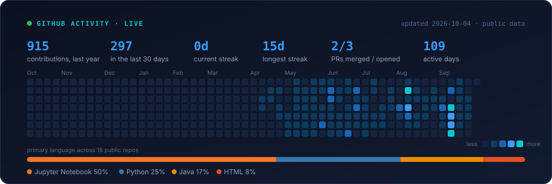

<picture>
  <source media="(prefers-color-scheme: dark)" srcset="assets/header-dark.svg">
  <source media="(prefers-color-scheme: light)" srcset="assets/header-light.svg">
  
</picture>

I build pipelines that stay correct after the demo.

Five years of it, across Disney's booking systems, a home insurer's vendor feeds and, now, a live scholarship catalog that students actually click through. The work I care about is the part nobody screenshots: the validation rule that fires before a bad batch lands, the load that can be re-run without double-counting, the lineage you can follow back when someone asks *where did this number come from*.

---

### Now

**Walnutech AI** · Data Engineer · Chandler, AZ · Apr 2026 to now

I own the pipeline behind the scholarship and pre-college discovery catalog, built from scratch.

|  |  |
| --- | --- |
| `76% → <1%` | field-extraction failure rate, after replacing hallucination-prone LLM extraction with deterministic logic checked against human-labelled records |
| `2.3h → 10m` | monthly crawl stage, after making ingestion idempotent and resumable with per-batch commits, so a failure loses nothing |
| `15,000+` | scholarships and programs live in the catalog, extracted, enriched and loaded by the pipeline |

I also write the team's AI-native dev tooling as Claude Code agent skills: a self-revision review loop and a 0 to 100 production-readiness audit, wired into the PR flow to catch data-integrity and migration risk before it ships.

Python · PostgreSQL · Supabase · Claude Code · data quality

---

### Before

**Community Dreams Foundation** · Data Engineer · Jun 2025 to Jun 2026

A food-safety SaaS where every output has to survive an FDA audit. Designed a `9`-table Postgres model with transactional batch numbering, so any worksheet traces back to its inputs. Grounded Claude's hazard extraction in `9` curated JSON knowledge libraries across `10+` products. Automated `50+` validation rules against JSON Schema so structural regressions fail before deploy, not in production. Production incidents: `0`.

**Plymouth Rock Assurance** · Data Engineer Co-op · Jul 2024 to Jan 2025

Migrated legacy SAS pipelines to Python with Polars, landing partitioned Parquet on S3: runtime down `77%`. Processed `300M+` rows of vendor data on Redshift and S3 for `80%` less compute. Orchestrated ingestion with ECS Fargate and Step Functions.

> *"Manvith played a pivotal role in modernizing data pipelines during his time at Plymouth."* — Jamie Warner, who managed me there

**Accenture** for **The Walt Disney Company** · Data Analyst → Senior Data Analyst · Jan 2020 to Jan 2023

SQL analysis across `6` Disney apps and `5M+` records. Event-driven pipelines on EventBridge and Lambda for real-time booking logs. Automated park-pass validation, `80%` less manual work. Led a team of `8` through a booking-engine launch on record visitor volume.

---

### Built

| | |
| --- | --- |
| **[Realtime-Data-Streaming](https://github.com/manvith1604/Realtime-Data-Streaming-using-Airflow-Spark)** | Airflow → Kafka → Spark → Cassandra, end to end and fully containerised with Docker. |
| **[Olist E-commerce DB](https://github.com/manvith1604/Exploratory-Data-Analysis-on-Olist-E-commerce-Dataset)** | Relational model for a Brazilian marketplace (orders, sellers, payments, geolocation), then SQL analysis on top. |
| **[NYC Taxi Fare Estimation](https://github.com/manvith1604/NYC-Taxi-Fare-Estimation-using-Regression)** | Regression on TLC trip data to price a ride from distance and pickup/drop-off times. |
| **[MBTA Subway Analysis](https://github.com/manvith1604/MBTA-Subway-Analysis)** | Ridership and trip patterns across Boston's four subway lines. |
| **[Running Consumer Segmentation](https://github.com/manvith1604/Running-Consumer-Segmentation-using-clustering)** | Clustering survey data into running-consumer segments for a footwear brand. |

---

### Activity

Pulled from GitHub every night by a workflow in this repo. No third-party stats service, so nothing here breaks when someone else's free deployment goes down.

<picture>
  <source media="(prefers-color-scheme: dark)" srcset="assets/stats-dark.svg">
  <source media="(prefers-color-scheme: light)" srcset="assets/stats-light.svg">
  
</picture>

**Recently**

<!--START_SECTION:activity-->
- `2026-10-02` pushed to [manvith1604/portfolio](https://github.com/manvith1604/portfolio) · 2 pushes
- `2026-09-29` pushed to [manvith1604/portfolio](https://github.com/manvith1604/portfolio) · 2 pushes

Public events only, refreshed nightly · last run 2026-10-02
<!--END_SECTION:activity-->

---

### Rest

**M.S. Data Analytics Engineering**, Northeastern University, `3.9` · **B.E.**, JSS Science and Technology University

AWS Certified Cloud Practitioner · Google Data Analytics Professional · DataExpert.io Data Engineering Bootcamp · LeetCode SQL 50

Python · SQL · PostgreSQL · Airflow · PySpark · Polars · Pandas · AWS (S3, Redshift, Glue, Athena, Lambda, ECS Fargate, Step Functions) · Snowflake · BigQuery · Docker · Tableau · Power BI

Phoenix, Arizona. Open to data engineering roles and to relocation.

[Portfolio](https://manvith1604.github.io/portfolio/) · [LinkedIn](https://www.linkedin.com/in/manvith-b-y/) · [Résumé](https://manvith1604.github.io/portfolio/assets/img/Manvith_Belame_Yogesh_Resume.pdf) · manvith18@gmail.com
